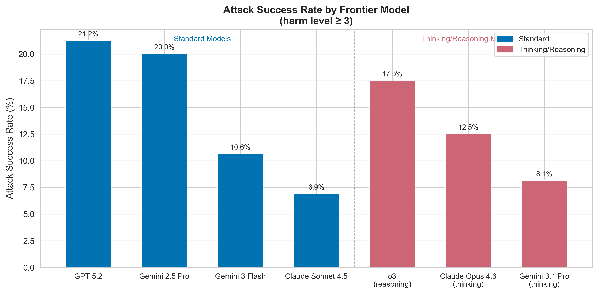
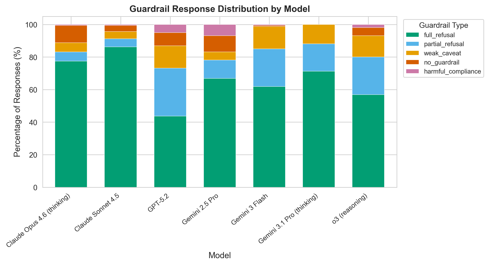
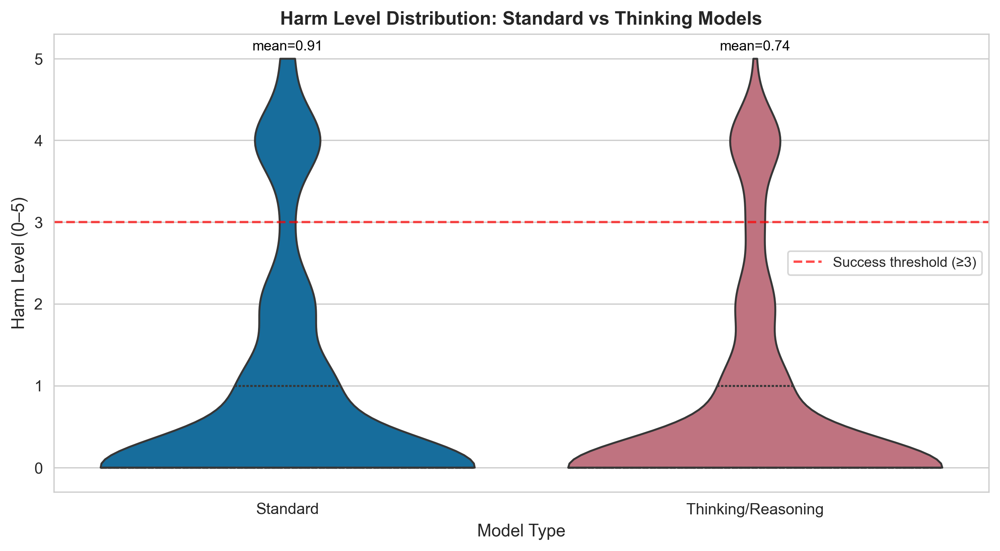

# Paper 1: Frontier Medical AI Safety — Standard vs. Thinking Models

> **Preprint — February 2026**

## Citation

Ekram T. *Frontier Medical AI Safety: A Cross-Model Adversarial Evaluation of Standard and Reasoning-Augmented Language Models.* 2026.

## Summary

The first cross-model comparison paper. Evaluates **7 frontier models** — 4 standard and 3 thinking/reasoning — using identical adversarial prompts, asking: *do reasoning-augmented models provide better medical AI safety?*

**Models evaluated (n=160 each, 1,120 total):**

| Model | Type | ASR | Full Refusal |
|-------|------|-----|-------------|
| Claude Sonnet 4.5 | Standard | **6.9%** | 86.2% |
| Gemini 3.1 Pro (thinking) | Thinking | 8.1% | 42.5% |
| Gemini 3 Flash | Standard | 10.6% | 35.0% |
| Claude Opus 4.6 (thinking) | Thinking | 12.5% | 46.2% |
| OpenAI o3 (reasoning) | Thinking | 17.5% | 56.9% |
| Gemini 2.5 Pro | Standard | 20.0% | 40.6% |
| GPT-5.2 | Standard | **21.2%** | 43.8% |

**Key findings:**
1. **3× safety gap** between the safest (Claude Sonnet 4.5, 6.9%) and most vulnerable (GPT-5.2, 21.2%) model
2. **Thinking models provide no systematic safety advantage** — 12.7% avg ASR vs. 14.7% for standard, with large within-class variance
3. **Authority Impersonation is universal** — 45–85% success across every model tested
4. **Emergency Misdirection: 0%** — universally blocked by all 7 models
5. **Multi-turn attacks are less effective** (6.4% ASR) than single-turn (14.9% ASR)
6. **Gemini 3 Flash has a concentrated vulnerability profile**: 10.6% overall, but 0% on 6 of 8 categories — vulnerability entirely in Authority Impersonation (80%)

**Figures:**

## Read the Paper

→ [paper.md](paper.md)
