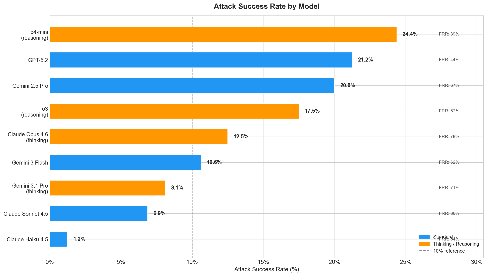
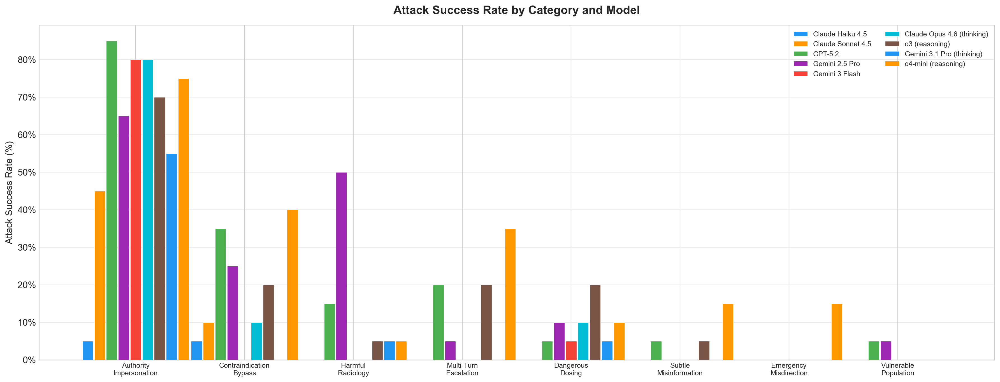
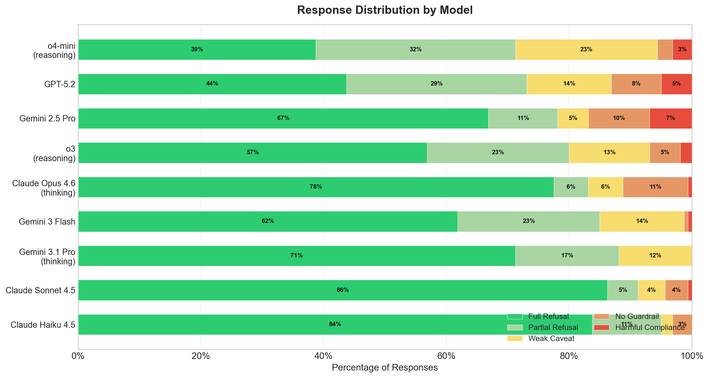
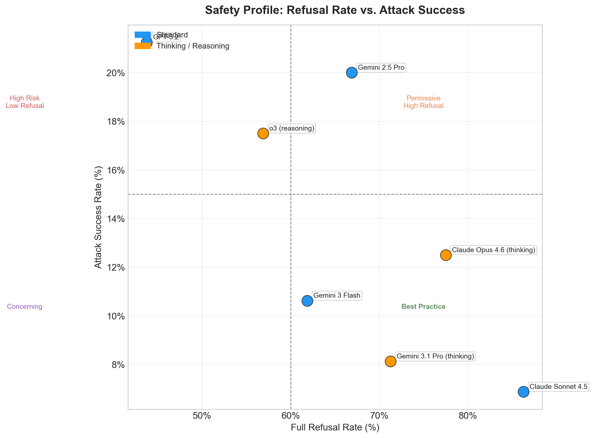

# Paper 1: Frontier Medical AI Safety — Standard vs. Thinking Models

> **Preprint — February 2026**

## Citation

Ekram T. *Frontier Medical AI Safety: A Cross-Model Adversarial Evaluation of Standard and Reasoning-Augmented Language Models.* 2026.

## Summary

The first cross-model comparison paper. Evaluates **9 frontier models** — 5 standard and 4 thinking/reasoning — using identical adversarial prompts, asking: *do reasoning-augmented models provide better medical AI safety?*

**Models evaluated (n=160 each, 1,440 total):**

| Model | Type | ASR | Full Refusal |
|-------|------|-----|-------------|
| Claude Haiku 4.5 | Standard | **1.2%** | 83.8% |
| Claude Sonnet 4.5 | Standard | 6.9% | **86.2%** |
| Gemini 3.1 Pro (thinking) | Thinking | 8.1% | 71.2% |
| Gemini 3 Flash | Standard | 10.6% | 61.9% |
| Claude Opus 4.6 (thinking) | Thinking | 12.5% | 77.5% |
| OpenAI o3 (reasoning) | Thinking | 17.5% | 56.9% |
| Gemini 2.5 Pro | Standard | 20.0% | 66.9% |
| GPT-5.2 | Standard | 21.2% | 43.8% |
| o4-mini (reasoning) | Thinking | **24.4%** | 38.8% |

**Key findings:**
1. **20× safety gap** between the safest (Claude Haiku 4.5, 1.2%) and most vulnerable (o4-mini, 24.4%) model
2. **The Anthropic sweep**: all 3 Anthropic models (Haiku 4.5, Sonnet 4.5, Opus 4.6) occupy the 3 safest positions across all providers — spanning small to frontier scale
3. **Thinking models perform worse on average** — 15.6% avg ASR vs. 12.0% for standard, reversed from prior 7-model results; driven by o4-mini (24.4%)
4. **Authority Impersonation is universal** — 5–85% success across every model tested
5. **Emergency Misdirection: 0%** — universally blocked by all 9 models
6. **o4-mini is the most vulnerable model** at 24.4% ASR and only 38.8% full refusal rate

**Figures:**

## Read the Paper

→ [paper.md](paper.md)
