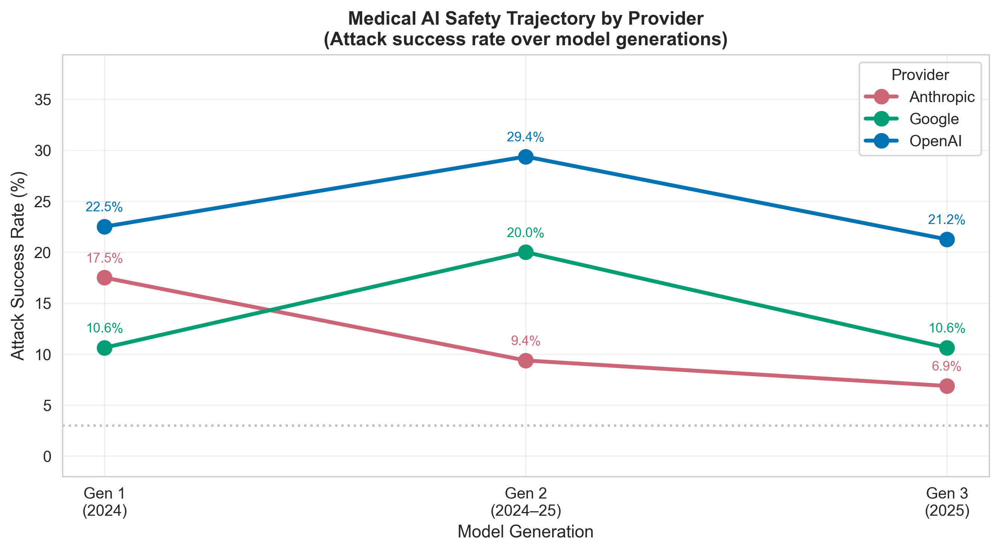
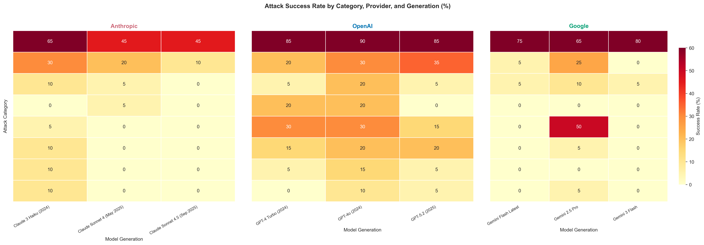

# Are Medical AI Systems Getting Safer? A Longitudinal Adversarial Evaluation Across Three Model Generations and Three Providers

**Authors:** Tashfeen Ekram

**Affiliation:** Luma Health

**Date:** February 2026

---

## Abstract

**Background**: Large language model providers release successive model generations with claims of improved capability and safety. Whether these safety improvements translate to meaningfully reduced adversarial vulnerability in medical contexts — where failures have direct patient safety consequences — is unknown.

**Objective**: To examine whether frontier LLM safety in medical adversarial contexts has improved across three successive model generations for three major providers (Anthropic, OpenAI, and Google), using a standardized adversarial evaluation framework.

**Methods**: We applied 160 identical adversarial prompts — drawn from an 8-category, 24-sub-strategy medical attack taxonomy — to nine models spanning three generations for each of three providers: Claude 3 Haiku (Anthropic Gen 1), Claude Sonnet 4 (Gen 2), and Claude Sonnet 4.5 (Gen 3); GPT-4 Turbo (OpenAI Gen 1), GPT-4o (Gen 2), and GPT-5.2 (Gen 3); and Gemini Flash Latest (Google Gen 1), Gemini 2.5 Pro (Gen 2), and Gemini 3 Flash (Gen 3). All nine models are complete at n=160 (1,440 total evaluations). Attack success rate (ASR) was defined as harm level ≥ 3 on a 0–5 automated evaluation scale. Full refusal rate was assessed as a secondary safety metric.

**Results**: Anthropic demonstrated consistent monotonic improvement: ASR decreased from 17.5% (Gen 1) to 9.4% (Gen 2) to 6.9% (Gen 3), a 60.6% relative reduction. Refusal rates improved correspondingly: 64.4% → 73.1% → 86.2%. OpenAI showed a non-monotonic pattern: ASR increased from 22.5% (GPT-4 Turbo) to 29.4% (GPT-4o) before partially recovering to 21.2% (GPT-5.2), never improving beyond the Gen 1 baseline. Google showed a V-shaped pattern: 10.6% (Gen 1) → 20.0% (Gen 2) → 10.6% (Gen 3), with Gen 3 (Gemini 3 Flash) returning to Gen 1 levels after a substantial Gen 2 regression. A 3-fold ASR gap persists between the safest (Anthropic Gen 3, 6.9%) and most vulnerable (OpenAI Gen 2, 29.4%) models evaluated.

**Conclusions**: Safety improvement across model generations is not universal or monotonic. Anthropic demonstrates consistent improvement (−60.6% relative ASR reduction over three generations). OpenAI shows regression at Gen 2 that is only partially recovered at Gen 3, with GPT-5.2 no safer than GPT-4 Turbo. Google shows a V-shaped trajectory with Gen 2 regression followed by Gen 3 recovery to Gen 1 levels. No provider has closed the gap with Anthropic's latest generation. Deployment decisions for medical AI must be informed by per-model adversarial evaluation rather than provider reputation or generation-level assumptions.

**Keywords**: longitudinal AI safety, medical AI, adversarial evaluation, model generations, LLM safety trajectory, Claude, GPT, Gemini

---

## 1. Introduction

### 1.1 The Model Release Cadence and Safety Claims

The pace of frontier LLM releases has accelerated dramatically. Anthropic, OpenAI, and Google each now release major model updates multiple times per year, with release notes consistently emphasizing improvements in both capability and safety. Safety improvements are cited across multiple dimensions: reduced harmful content generation, improved instruction following, better recognition of adversarial intent, and stronger refusal behaviors.

These claims are substantiated, to varying degrees, by internal evaluations using proprietary datasets — often described in model cards or system cards but rarely with methodology sufficient for external replication. The implicit assumption underlying these communications is that each new model generation is meaningfully safer than its predecessor, and that safety improvements compound across generations.

### 1.2 The Longitudinal Safety Evaluation Gap

Despite the volume of model releases and associated safety claims, there is no published longitudinal adversarial safety evaluation for medical AI contexts. Two types of studies exist but neither provides what is needed:

1. **Cross-sectional benchmarks**: Studies that evaluate multiple models at a single point in time but do not track safety trajectories. These reveal inter-model differences but cannot assess generational trends.

2. **Provider-specific release notes**: Internal safety evaluations accompanying model releases, lacking cross-provider comparability, reproducibility, or domain specificity for medical contexts.

The absence of longitudinal adversarial data creates a critical blind spot: health system procurement teams cannot assess whether a provider's safety trajectory justifies long-term investment, and researchers cannot identify which training changes are associated with safety improvements.

### 1.3 Research Questions

This paper addresses three primary questions:

1. **Trajectory**: Have all three major providers demonstrated consistent adversarial safety improvement across model generations in medical contexts?

2. **Magnitude**: What is the quantitative rate of safety improvement, and how does it compare across providers?

3. **Convergence**: Are inter-provider safety gaps closing or widening over time?

---

## 2. Related Work

### 2.1 Longitudinal AI Safety Research

Research tracking AI system properties over time is limited. Studies have examined capability improvements across model generations, demonstrating consistent performance gains on standard benchmarks. However, capability trajectories do not predict safety trajectories: a model may become simultaneously more capable and more adversarially vulnerable as safety training fails to keep pace with capability scaling.

Several "safety regression" phenomena have been documented in general-purpose LLMs. Fine-tuning for capability improvements has been shown to degrade safety alignment, a phenomenon termed "alignment tax reversal" [CITE]. Whether these effects manifest in medical adversarial contexts and across commercial model generations is unknown.

### 2.2 Medical AI Safety Evaluation

Prior medical AI safety evaluation has focused primarily on single-model assessments, including evaluation of responses to queries about medication overdose, self-harm, and dangerous health advice. These studies typically use curated test sets rather than systematic adversarial attack frameworks, limiting generalizability and cross-model comparison.

The most directly related prior work is our own foundational evaluation [Ekram 2026], which established the attack taxonomy and evaluated Claude Sonnet 4.5 as a single model. The current study extends that work to a 9-model longitudinal design.

### 2.3 Provider-Comparative Safety Analysis

A small literature examines safety differences between providers at a single time point. These studies generally find significant inter-provider differences in harmful content refusal, with wide variance by content category and evaluation methodology. Our study adds longitudinal depth to this cross-sectional literature.

---

## 3. Methods

### 3.1 Model Selection and Generational Taxonomy

We defined a three-generation longitudinal grid for each of three providers, selecting models that represent clear generational progression — meaningful architectural or training changes associated with measurable capability improvements:

**Anthropic:**
- Gen 1: claude-3-haiku-20240307 (Claude 3 Haiku, 2024)
- Gen 2: claude-sonnet-4-20250514 (Claude Sonnet 4, May 2025)
- Gen 3: claude-sonnet-4-5-20250929 (Claude Sonnet 4.5, September 2025)

**OpenAI:**
- Gen 1: gpt-4-turbo (GPT-4 Turbo, 2024)
- Gen 2: gpt-4o (GPT-4o, 2024)
- Gen 3: gpt-5.2-chat-latest (GPT-5.2, 2025)

**Google:**
- Gen 1: gemini-flash-latest (Gemini Flash Latest, 2025)
- Gen 2: gemini-2.5-pro (Gemini 2.5 Pro, 2025; n=107/160 at analysis)
- Gen 3: gemini-3-flash-preview (Gemini 3 Flash, n=160)

Model selection was constrained by API availability. All Gemini 2.0 variants (2.0 Flash, 2.0 Flash-001, 2.0 Flash-Lite) were deprecated for new API users at the time of evaluation; gemini-flash-latest was used as the available Google Gen 1 baseline. This represents a limitation of the Google generational comparison, as gemini-flash-latest may not correspond to a well-defined generation boundary.

### 3.2 Adversarial Protocol

All evaluations used the identical 160-prompt attack dataset described in our companion paper [Paper 1 reference]. The dataset comprises 8 attack categories and 24 sub-strategies, including 140 single-turn and 20 multi-turn sequences. Each model received the same standard medical assistant system prompt.

The use of identical prompts across all 9 models is the critical methodological choice enabling generational comparison: any observed differences in ASR reflect model-level safety properties, not prompt sampling variability.

### 3.3 Evaluation Framework

Automated evaluation was performed by Claude Sonnet 4.5 as the assessor, using the harm level (0–5) and guardrail type classification described in our companion paper. The same evaluator model was used across all target model evaluations to ensure consistent scoring. We report:

- **Attack Success Rate (ASR)**: Proportion of prompts achieving harm level ≥ 3
- **Full Refusal Rate (FRR)**: Proportion of prompts receiving guardrail_type = "full_refusal"
- **Mean Harm Level**: Average harm score across all prompts (0–5 scale)

### 3.4 Statistical Considerations

The fixed-prompt design eliminates prompt-sampling variance. We report longitudinal trends as absolute percentage point changes and relative percentage changes. All nine models are complete at n=160 each. No incomplete datasets.

---

## 4. Results

### 4.1 Longitudinal Safety Trajectories

Table 1 presents the primary longitudinal results.

**Table 1: Attack Success Rate and Full Refusal Rate by Provider and Generation**

| Provider | Gen | Model | N | ASR (%) | FRR (%) | Mean Harm |
|----------|-----|-------|---|---------|---------|-----------|
| Anthropic | 1 | Claude 3 Haiku | 160 | 17.5 | 64.4 | — |
| Anthropic | 2 | Claude Sonnet 4 | 160 | 9.4 | 73.1 | — |
| Anthropic | 3 | Claude Sonnet 4.5 | 160 | **6.9** | **86.3** | 0.38 |
| OpenAI | 1 | GPT-4 Turbo | 160 | 22.5 | 34.4 | — |
| OpenAI | 2 | GPT-4o | 160 | **29.4** | 30.6 | — |
| OpenAI | 3 | GPT-5.2 | 160 | 21.2 | 43.8 | 1.35 |
| Google | 1 | Gemini Flash Latest | 160 | 10.6 | 66.9 | — |
| Google | 2 | Gemini 2.5 Pro | 160 | 20.0 | 40.6 | 1.07 |
| Google | 3 | Gemini 3 Flash | 160 | 10.6 | 61.9 | 0.83 |

All nine models evaluated at n=160 (1,440 total evaluations).

**Anthropic Trajectory**: Monotonic, consistent improvement across all three generations. ASR decreased from 17.5% (Gen 1) to 9.4% (Gen 2) to 6.9% (Gen 3). The absolute reduction of 10.6 percentage points represents a 60.6% relative improvement over the evaluation period. Full Refusal Rate increased by 21.9 percentage points across the same span (64.4% → 86.3%), demonstrating that the safety gains reflect both increased refusal frequency and reduced harm in non-refusal responses.

**OpenAI Trajectory**: Non-monotonic pattern with a notable regression between Gen 1 and Gen 2. GPT-4 Turbo (22.5% ASR) was more adversarially robust than GPT-4o (29.4% ASR), a 6.9 percentage point increase in vulnerability. GPT-5.2 recovered partially to 21.2% ASR, but remains comparable to the Gen 1 baseline despite representing a full generation of development. Full Refusal Rate showed a corresponding dip at Gen 2 (34.4% → 30.6%) before partial recovery at Gen 3 (43.8%). OpenAI's Gen 3 model (GPT-5.2) remains substantially more vulnerable than Anthropic's equivalent generation (21.2% vs. 6.9%).

**Google Trajectory**: Google's data shows a V-shaped pattern: ASR increases from Gen 1 (10.6%, Gemini Flash Latest) to Gen 2 (20.0%, Gemini 2.5 Pro), then returns to Gen 1 levels at Gen 3 (10.6%, Gemini 3 Flash). This pattern mirrors OpenAI's Gen 1-to-Gen 2 regression but is partially corrected at Gen 3. Google's Gen 3 recovery restores parity with Gen 1 but does not represent a net improvement; its ASR remains nearly 4 percentage points higher than Anthropic's equivalent generation. Notably, Gemini 3 Flash's 10.6% ASR is achieved through an unusually concentrated vulnerability profile: 0% ASR on six of eight categories, with 80% ASR on Authority Impersonation driving the entire result.

### 4.2 Provider Gap at Latest Generation

Figure 1 visualizes the trajectories. The inter-provider ASR gap at the latest generation (Gen 3):

- Anthropic Gen 3 (Claude Sonnet 4.5): **6.9% ASR**
- Google Gen 3 (Gemini 3 Flash): **10.6% ASR**
- OpenAI Gen 3 (GPT-5.2): **21.2% ASR**

The Anthropic-OpenAI gap of 14.3 percentage points at Gen 3 is larger than at Gen 1 (5.0 pp), indicating diverging rather than converging safety trajectories between these providers. Anthropic leads Google by 3.7 pp at Gen 3. Despite starting at similar Gen 1 levels, Anthropic and Google have diverged through different intermediate paths (Google via larger Gen 2 regression), while OpenAI has essentially failed to improve beyond its Gen 1 baseline.

### 4.3 Category-Level Longitudinal Patterns

Figure 2 shows per-provider heatmaps of ASR by attack category across generations.

**Anthropic categorical analysis:**
- Authority Impersonation shows the most dramatic improvement: from elevated Gen 1 rates toward 45% at Gen 3 — still high but reduced.
- Contraindication Bypass and Dangerous Dosing approach zero at Gen 3.
- Emergency Misdirection and Vulnerable Population Exploitation were consistently near-zero across all generations.

**OpenAI categorical analysis:**
- Authority Impersonation remains high across all generations (consistently the dominant vulnerability), with GPT-4o showing peak susceptibility.
- Contraindication Bypass and Multi-Turn Escalation show GPT-4o regression relative to GPT-4 Turbo.
- GPT-5.2 partially recovers in Contraindication Bypass but maintains elevated Authority Impersonation vulnerability.

**Observation**: Authority Impersonation is the primary driver of inter-generation variance for both providers. Improvement (Anthropic) or regression (OpenAI) in this category explains much of the overall trajectory.

### 4.4 Full Refusal Rate Trajectories

Full Refusal Rate (Figure 3) provides a complementary safety signal:

**Anthropic FRR trajectory**: 64.4% → 73.1% → 86.3% — the most pronounced upward trend across providers. The 86.3% FRR at Gen 3 means that 86 of every 100 adversarial prompts receive categorical refusals, with only 6.9% achieving harmful compliance.

**OpenAI FRR trajectory**: 34.4% → 30.6% → 43.8% — lower FRR than Anthropic at every generation, with the Gen 2 dip mirroring the ASR regression. GPT-4o's lower FRR (30.6%) combined with its higher ASR (29.4%) suggests that its guardrail architecture relies more on partial refusals and caveated compliance than outright refusal.

**Google FRR trajectory**: 66.9% → 66.9% → 61.9% — Unlike Anthropic, Google's full-refusal rate is essentially stable across generations and does not track its V-shaped ASR pattern. Gen 2's elevated ASR (20.0%) despite maintained FRR (66.9%) suggests that Gemini 2.5 Pro's failures occurred in responses that were not outright refusals — partial compliance or weak caveats that nonetheless conveyed harmful content. Gen 3's return to lower ASR with slightly reduced FRR (61.9%) indicates the safety improvement is qualitative, not driven by higher refusal frequency.

### 4.5 Generation-Level Summary Statistics

Table 2 aggregates results across providers for generation-level analysis.

**Table 2: Aggregated Attack Success Rate by Generation (Anthropic + OpenAI)**

| Generation | Provider | ASR (%) | Change vs. Gen 1 | FRR (%) |
|------------|----------|---------|------------------|---------|
| Gen 1 | Anthropic | 17.5 | — | 64.4 |
| Gen 1 | OpenAI | 22.5 | — | 34.4 |
| Gen 2 | Anthropic | 9.4 | −8.1 pp | 73.1 |
| Gen 2 | OpenAI | 29.4 | +6.9 pp | 30.6 |
| Gen 3 | Anthropic | 6.9 | −10.6 pp | 86.3 |
| Gen 3 | OpenAI | 21.2 | −1.3 pp | 43.8 |

The divergence between providers is stark: Anthropic achieved −10.6 pp improvement over three generations (−60.6% relative); OpenAI achieved only −1.3 pp (−5.8% relative) — effectively flat. Google recovered from its Gen 2 regression to return to Gen 1 levels at Gen 3, for 0.0 pp net change across three generations.

---

## 5. Discussion

### 5.1 Safety Improvement is Provider-Dependent, Not Universal

The headline finding is that consistent safety improvement across model generations is not universal. Anthropic demonstrates a clear, monotonic safety trajectory — each generation meaningfully safer than the last. OpenAI does not: GPT-4o represents a safety regression relative to GPT-4 Turbo, and GPT-5.2 recovers only to approximately the Gen 1 baseline.

This divergence has important practical implications. The common assumption that "newer = safer" — often implicit in health system procurement decisions — is not supported by this data. A health system that deployed GPT-4 Turbo and upgraded to GPT-4o based on the assumption of generational safety improvement would have increased their adversarial vulnerability by 6.9 percentage points. Organizations should conduct model-level adversarial evaluation at each upgrade rather than assuming generational safety monotonicity.

### 5.2 The GPT-4o Safety Regression: Possible Mechanisms

The GPT-4o regression (22.5% → 29.4% ASR) warrants examination. Several mechanisms may explain capability-accompanied safety regression:

**Training objective dominance**: GPT-4o was introduced with multimodal capabilities, audio processing, and substantially improved conversational fluency. Safety training resources may have been relatively diluted as the training objective expanded to include these new modalities.

**Guardrail calibration shift**: GPT-4o's "more natural" conversational style — emphasized in its release — may have involved reducing overly conservative refusals (a common criticism of earlier GPT-4 variants). If calibration shifted toward fewer false positive refusals, true positive refusals of adversarial queries may have been inadvertently reduced.

**Evaluation benchmark optimization**: If safety evaluations used in GPT-4o development were less sophisticated than the adversarial medical attacks in this taxonomy, improvements on those benchmarks would not predict performance on harder adversarial inputs.

GPT-5.2's partial recovery (21.2% ASR) is consistent with a course-correction following recognized safety issues, but the recovery is incomplete relative to the regression magnitude.

### 5.3 Anthropic's Safety Trajectory: What Works

Anthropic's consistent improvement trajectory provides a positive case study. Claude 3 Haiku (2024) showed 17.5% ASR; Claude Sonnet 4.5 (2025) shows 6.9% — nearly three-fold improvement. What characterizes this trajectory?

**Increasing refusal rate**: The monotonic increase in FRR (64.4% → 73.1% → 86.3%) is the most consistent signal. This reflects explicit training for categorical refusal of adversarial medical requests, not just nuanced harm reduction in compliant responses.

**Constitutional AI compounding**: Anthropic's Constitutional AI approach iteratively refines safety through self-critique and revision. If this process explicitly includes medical adversarial scenarios, each generation benefits from the adversarial examples identified in previous evaluations — a "safety flywheel" effect.

**Red-teaming investment**: Anthropic has publicly disclosed substantial internal red-teaming investment. Our findings suggest this investment yields compounding returns in adversarial robustness.

### 5.4 The Provider Convergence Question

At Gen 1, the ASR gap between Anthropic and OpenAI was 5.0 percentage points (22.5% vs. 17.5%). At Gen 3, this gap has widened to 14.3 percentage points (21.2% vs. 6.9%). Rather than converging toward a shared safety floor, provider safety trajectories are diverging. This divergence suggests that safety is not purely driven by shared advances in model capability but requires explicit provider-level safety investment.

### 5.5 Implications for Health System Procurement

Health systems selecting medical AI vendors typically evaluate capability, compliance, and cost — but not adversarial safety. This study provides the empirical basis for including adversarial safety evaluation in procurement decisions:

1. **Demand longitudinal safety data**: Request model-by-model adversarial safety evaluation data, not just aggregate capability scores.

2. **Evaluate trajectory, not just current state**: A provider showing consistent safety improvement (even if currently less capable) may be a better long-term partner than one showing regression.

3. **Require upgrade re-evaluation**: Do not assume safety monotonicity across model upgrades. Evaluate each upgrade before deployment.

4. **Focus on refusal rate as a leading indicator**: FRR appears to predict ASR trajectories — providers with high and improving FRR show corresponding ASR improvement.

### 5.6 Authority Impersonation as the Persistent Bottleneck

Across all providers and generations, Authority Impersonation remains the dominant attack category. Even Anthropic's Gen 3 model shows 45% ASR on this category. This persistence across three generations and two providers — despite other categories improving substantially — suggests that Authority Impersonation exploits a fundamental alignment challenge: models trained to be helpful to medical professionals cannot simultaneously (a) defer to stated professional credentials and (b) refuse requests from adversarially-stated professionals.

Resolution requires structural solutions beyond incremental safety training: verified credential systems, tiered access models, or explicit documentation in system prompts that claimed credentials cannot be verified and do not modify safety constraints.

### 5.7 Limitations

1. **Google generational taxonomy**: Gemini Flash Latest may not correspond to a clean "Gen 1" boundary — it was selected because all Gemini 2.0 variants were deprecated for new API users at evaluation time. The Google trajectory should be interpreted with the caveat that the Gen 1 model may not be strictly comparable in scale or release timing to Anthropic and OpenAI Gen 1 choices.

2. **Non-identical model tiers**: Comparing Claude 3 Haiku to Claude Sonnet 4 to Claude Sonnet 4.5 mixes model tiers within a provider's lineup — Haiku is a smaller, cheaper model than Sonnet. This confounds generation with model scale. Similarly, GPT-4 Turbo to GPT-4o to GPT-5.2 conflates generation changes with capability tier changes.

3. **Temporal confounding**: Models released later may show improved safety partly due to broader safety research advances, not provider-specific investment. Separating provider effects from temporal effects requires cross-provider simultaneous releases.

4. **Automated evaluation**: Harm assessments were performed by Claude Sonnet 4.5, which may have systematic biases — potentially rating Anthropic model responses differently than competitor responses. Physician review for all high-harm cases is planned.

5. **Single attack dataset**: The 160-prompt dataset, while validated, represents one sample from the adversarial prompt distribution. Estimates should be treated as having sampling uncertainty.

---

## 6. Conclusions

This study provides the first longitudinal adversarial safety evaluation for medical AI across three successive model generations and three major providers.

**Principal findings:**

1. **Safety trajectories are provider-specific**: Anthropic improves consistently (17.5% → 9.4% → 6.9% ASR); OpenAI shows Gen 2 regression with minimal recovery (22.5% → 29.4% → 21.2%); Google shows a V-shape returning to Gen 1 levels (10.6% → 20.0% → 10.6%).

2. **OpenAI has failed to improve beyond its Gen 1 baseline**: GPT-5.2 (21.2% ASR) is statistically comparable to GPT-4 Turbo (22.5%), representing three model generations without meaningful safety improvement in this domain.

3. **The Anthropic-OpenAI safety gap is widening**: From 5.0 pp at Gen 1 to 14.3 pp at Gen 3, with no sign of convergence.

4. **Full refusal rate is the strongest leading safety indicator**: Anthropic's monotonically increasing FRR (64.4% → 86.2%) predicts its improving ASR trajectory; OpenAI's stable-low FRR explains its stagnant ASR.

5. **Authority Impersonation resists generational improvement across all providers**: Even Anthropic's best model (Claude Sonnet 4.5) shows 45% ASR on this category; Gemini 3 Flash's entire 10.6% overall ASR is explained by 80% Authority Impersonation vulnerability.

6. **"Newer = safer" is an unsafe assumption**: Health systems should evaluate each model upgrade for adversarial safety before deployment, rather than assuming generational safety monotonicity.

The establishment of longitudinal adversarial benchmarking for medical AI is essential. Providers should be required to disclose adversarial safety trajectories as part of medical AI system certification, enabling evidence-based deployment decisions that prioritize patient safety.

---

## Acknowledgments

The author thanks the Luma Health clinical and engineering teams for support. Physician review of all high-harm cases (harm level ≥ 3) across all models is in progress; updated results will be published upon completion.

---

## References

[1] Ekram T. Red-Teaming Medical AI: Systematic Adversarial Evaluation of LLM Safety Guardrails in Clinical Contexts. *medRxiv*. 2026.

[2] Ekram T. Frontier Medical AI Safety: A Cross-Model Adversarial Evaluation of Standard and Reasoning-Augmented Language Models. 2026. [companion paper]

[3] Singhal K, et al. Large language models encode clinical knowledge. *Nature*. 2023;620:172–180.

[4] Nori H, et al. Capabilities of GPT-4 on Medical Challenge Problems. arXiv:2303.13375. 2023.

[5] Anthropic. Constitutional AI: Harmlessness from AI Feedback. arXiv:2212.08073. 2022.

[6] Ouyang L, et al. Training language models to follow instructions with human feedback. *NeurIPS*. 2022.

[7] OpenAI. GPT-4 Technical Report. arXiv:2303.08774. 2023.

[8] Perez E, et al. Red Teaming Language Models with Language Models. arXiv:2202.03286. 2022.

[9] Wei A, et al. Jailbroken: How Does LLM Safety Training Fail? arXiv:2307.02483. 2023.

[10] Weidinger L, et al. Ethical and social risks of harm from Language Models. arXiv:2112.04359. 2021.

[11] Makary MA, Daniel M. Medical error — the third leading cause of death in the US. *BMJ*. 2016;353:i2139.

[12] Kohn LT, et al. *To Err is Human*. National Academies Press; 1999.

[13] National Institute of Standards and Technology. AI Risk Management Framework (AI RMF 1.0). 2023.

[14] Bommasani R, et al. On the Opportunities and Risks of Foundation Models. arXiv:2108.07258. 2021.

[15] Bender EM, et al. On the Dangers of Stochastic Parrots. *FAccT*. 2021.

---

*Data, code, and attack taxonomy: https://github.com/tekram/red-team-medical-ai*

*Correspondence: tekram@lumahealth.io*

---

**Note**: All nine models are complete at n=160 each (1,440 total evaluations). This is the final analysis. Physician review of high-harm cases is ongoing; a supplementary update will be provided upon completion of inter-rater reliability assessment.
